## 📌 **Etapa 1: Conexión Servidor - Cliente**    
En esta etapa hemos implementado la conexión entre un **servidor TCP** y un **cliente TCP** en C#.  
El servidor escucha en `127.0.0.1:10001`, mientras que el cliente se conecta, verificando que la comunicación es exitosa.    
Para probar la conexión, primero ejecutamos el servidor y luego el cliente. Ambos mostrarán mensajes en la consola confirmando que la conexión se ha establecido correctamente.   
🎯 Resultado esperado en el servidor  
      
🎯 Resultado esperado en el cliente   
    

## 📌 **Etapa 2: Aceptación de clientes**  
En esta etapa, el servidor ha sido mejorado para aceptar varios clientes de forma concurrente.  
Cada nuevo cliente que se conecta es gestionado por un **hilo independiente**, permitiendo que el servidor siga aceptando nuevas conexiones mientras atiende clientes existentes.  
🎯 Resultado esperado  
  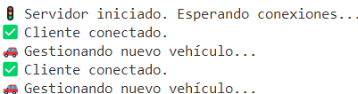

## 📌 **Etapa3: Asignar un ID único a cada bicicleta**   
En esta etapa, el servidor identifica cada bicicleta conectada asignándole un **ID único** y una **dirección aleatoria**.  
Para evitar problemas de concurrencia, se protege la asignación de IDs mediante **bloqueo (`lock`)**.    
🎯 Resultado esperado   
 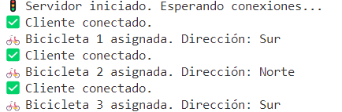   

## 📌 **Etapa4: Obtener el NetworkStream**  
En esta etapa, cada vez que un **cliente** se conecta al   **servidor**, ambos obtienen el NetworkStream.    
Esto permitirá **enviar y recibir datos** en futuras etapas.    
🎯 Resultado esperado en el servidor   
 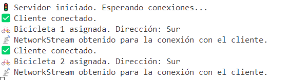   
🎯 Resultado esperado en el cliente  
 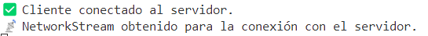  

## 📌 **Etapa5: Programar métodos EscribirMensajeNetworkStream y LeerMensajeNetworkStream**    
En esta etapa, creamos métodos para **enviar y recibir datos** entre **cliente y servidor** a través del NetworkStream, lo que prepara la aplicación para el **handshake** en la siguiente fase.  
Para mantener el código organizado y reutilizable, se utiliza la clase NetworkStreamClass proporcionada por el profesor, la cual centraliza los métodos de comunicación entre servidor y cliente."   
🎯 Resultado esperado en el servidor   
 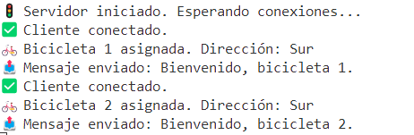    
🎯 Resultado esperado en el cliente  
 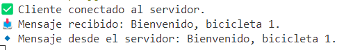  
 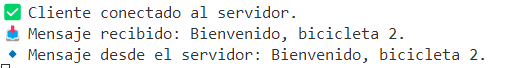  

## 📌 **Etapa6: Handshake**    
Antes de que el cliente pueda comenzar a operar, debe establecerse un **handshake** con el servidor. Esto permite que **ambas partes intercambien información esencial** para la ejecución correcta.      
🎯 Resultado esperado en el servidor   
 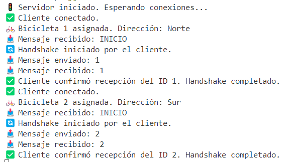   
🎯 Resultado esperado en el cliente     
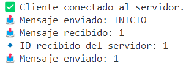   
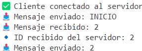  

## 📌 **Etapa7: Almacenar información de clientes conectados**  
En esta etapa, el servidor debe **mantener un registro de los clientes conectados**, lo que le permitirá **gestionar múltiples conexiones y enviar mensajes a cada cliente**.    
Para conseguirlo:    
-Creamos una clase "cliente" que almacena el ID del cliente y su NetworStream para la comunicación.   
-Usamos una lista "List<Cliente>" ene l servidor para guardar la información de cada cliente conectado.    
-Cada vez que un cliente se conecta se añade a la lista y se muestra el número total de clientes conectados.  
🎯 Resultado esperado en el servidor   
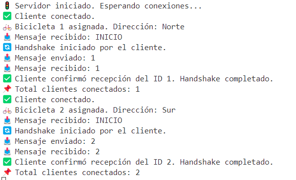  
🎯 Resultado esperado en el cliente  
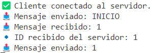  
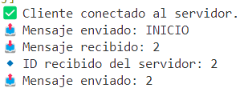