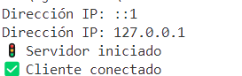

## 📌 **Etapa 1: Conexión Servidor - Cliente**    
En esta etapa hemos implementado la conexión entre un **servidor TCP** y un **cliente TCP** en C#.  
El servidor escucha en `127.0.0.1:10001`, mientras que el cliente se conecta, verificando que la comunicación es exitosa.    
Para probar la conexión, primero ejecutamos el servidor y luego el cliente. Ambos mostrarán mensajes en la consola confirmando que la conexión se ha establecido correctamente.   
🎯 Resultado esperado en el servidor  
    
🎯 Resultado esperado en el cliente   
