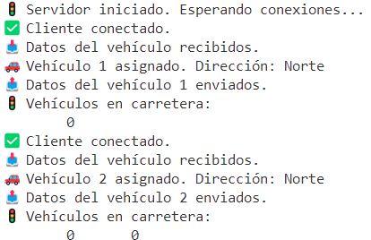
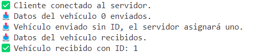
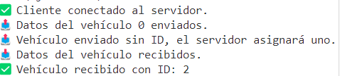
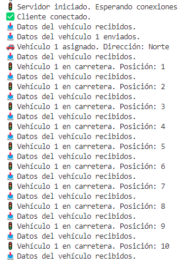
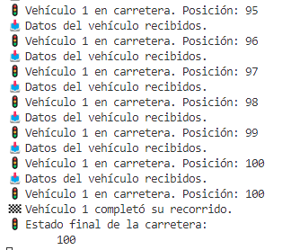
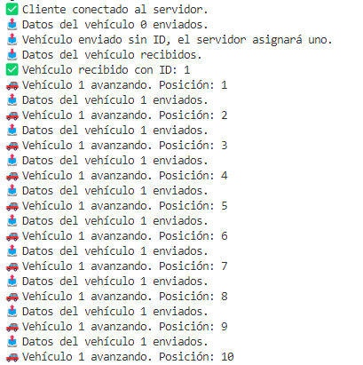
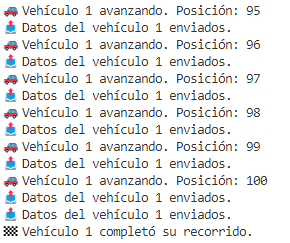

## 📌 **Etapa1:Programación de los métodos de la clase NetworkStreamClass**  
En esta etapa, hemos programado los métodos necesarios para **intercambiar datos de tipo "Vehiculo" y "Carretera"** entre el servidor y los clientes mediante "NetworkStream".  
Estos métodos serán fundamentales para la comunicación en las siguientes etapas del ejercicio.  

 // 📌 Método para escribir en NetworkStream los datos de tipo Carretera  
        public static void EscribirDatosCarreteraNS(NetworkStream NS, Carretera C)  
        {            
            try  
            {    
                byte[] datosCarretera = C.CarreteraABytes();  
                NS.Write(datosCarretera, 0, datosCarretera.Length);  
                Console.WriteLine($"📤 Datos de carretera enviados.");  
            }  
            catch (Exception ex)  
            {  
                Console.WriteLine($"❌ Error al enviar datos de carretera: {ex.Message}");  
            }  
        }  
// 📥 Método para leer desde NetworkStream los datos de un objeto Carretera  
        public static Carretera LeerDatosCarreteraNS(NetworkStream NS)  
        {  
            try  
            {  
                byte[] buffer = new byte[8192]; // Aumentar tamaño de buffer  
                MemoryStream ms = new MemoryStream();  
                int bytesLeidos = NS.Read(buffer, 0, buffer.Length);  
                ms.Write(buffer, 0, bytesLeidos);  
                Console.WriteLine($"📥 Datos de carretera recibidos.");  
                return Carretera.BytesACarretera(ms.ToArray());  
            }  
            catch (Exception ex)  
            {
                Console.WriteLine($"❌ Error al recibir datos de carretera: {ex.Message}");  
                return null;  
            }
        }  
 // 🚗 Método para enviar datos de Vehiculo a NetworkStream  
        public static void EscribirDatosVehiculoNS(NetworkStream NS, Vehiculo V)  
        {              
            try  
            {  
                byte[] datosVehiculo = V.VehiculoaBytes();  
                NS.Write(datosVehiculo, 0, datosVehiculo.Length);  
                Console.WriteLine($"📤 Datos del vehículo {V.Id} enviados.");  
            }  
            catch (Exception ex)  
            {  
                Console.WriteLine($"❌ Error al enviar datos del vehículo: {ex.Message}");  
            }  
        }  

// 📥 Método para leer desde NetworkStream los datos de un objeto Vehiculo  
        public static Vehiculo LeerDatosVehiculoNS(NetworkStream NS)  
        {  
            try  
            {  
                byte[] buffer = new byte[4096];  
                MemoryStream ms = new MemoryStream();  
                int bytesLeidos = NS.Read(buffer, 0, buffer.Length);  
                ms.Write(buffer, 0, bytesLeidos);  
                Console.WriteLine($"📥 Datos del vehículo recibidos.");  
                return Vehiculo.BytesAVehiculo(ms.ToArray());  
            }  
            catch (Exception ex)  
            {  
                Console.WriteLine($"❌ Error al recibir datos del vehículo: {ex.Message}");  
                return null;  
            }  

## 📌 **Etapa2:Crear y enviar los datos de un vehículo**      
En esta etapa, cada cliente **crea un nuevo vehículo** y lo envía al servidor utilizando "NetworkStreamClass".    
El servidor **recibe los datos del vehículo, le asigna un ID único y lo añade a la carretera**.    
Cuando se conectan varios clientes, cada vehículo aparece en la carretera con "Posición 0".  
Un cliente crea un vehículo sin ID porque no conoce cuántos vehículos hay en la carretera, y lo envía al servidor.  
El servidor asigna el siguiente número disponible (1, luego 2, luego 3...).  
El servidor devuelve el vehículo al cliente con el ID correcto.  
Con esto, garantizamos que los IDs sean únicos, secuenciales y organizados.  
🎯 Resultado esperado en el servidor   
  
🎯 Resultado esperado en el cliente    
  
  

## 📌 **Etapa3:Mover los vehículos**   
En esta etapa los vehículos **avanzan desde "Pos=0" hasta "Pos=100"**, enviando actualizaciones al servidor en cada paso.  
El servidor **recibe los datos, actualiza la carretera y detiene la simulación cuando el vehículo termina** su recorrido.  
En el lado cliente:  
-Tiene un bucle que incrementa "Pos" hasta "100".  
-Cada actualización de posición se envía al servidor.
-Thread.Sleep(vehiculo.Vehiculo) regula el ritmo del avance.
-Cuando el vehículo llega a "Pos=100", se marca "Acabado=true" y se envía al servidor.
En el lado del servidor:
-Recibe los datos del vehículo y actualiza la carretera con "ActualizarVehiculo()".  
-Cuando "Acabado=true" el servidor detiene el seguimiento del vehículo.  
Cada actualización de posición se imprime en la consola para comprobar el avance.  

🎯 Resultado esperado en el servidor   
  
  
🎯 Resultado esperado en el cliente  
  
  

## 📌 **Etapa4:Enviar datos del servidor a todos los clientes**    
En esta etapa, el servidor **envía la información actualizada de la carretera a todos los clientes conectados**.    
Cada vez que un vehículo avanza, el servidor **actualiza la carretera y la comunica a los clientes**, asegurando que todos tengan la misma visión del tráfico en tiempo real.   
-Cada vez que un vehículo avanza, el servidor **actualiza la carretera**.    
-Luego **recorre la lista de clientes y les envía la carretera actualizada**.  
Cambios en el código:  
-Guardo una lista de clientes conectados:static List<TcpClient> listaClientes = new List<TcpClient>();   
-Cada vez que un cliente se conecta lo añado a la lista.  
lock (lockObj) {  
    listaClientes.Add(cliente);  
}  
-Cada vez que un vehículo avanza, el servidor actualiza la carretera y la envía a todos los clientes.    
carretera.ActualizarVehiculo(vehiculo);   
EnviarDatosACtodosLosClientes();    
-El servidor manda la carretera a todos los clientes conectados.    
static void EnviarDatosACtodosLosClientes()  
{  
    lock (lockObj)  
    {  
        foreach (TcpClient cliente in listaClientes)  
        {  
            try  
            {  
                NetworkStream stream = cliente.GetStream();
                NetworkStreamClass.EscribirDatosCarreteraNS(stream, carretera);   
            }  
            catch (Exception ex)  
            {  
                Console.WriteLine($"❌ Error al enviar datos a un cliente: {ex.Message}");  
            }  
        }  
    }  
}  

